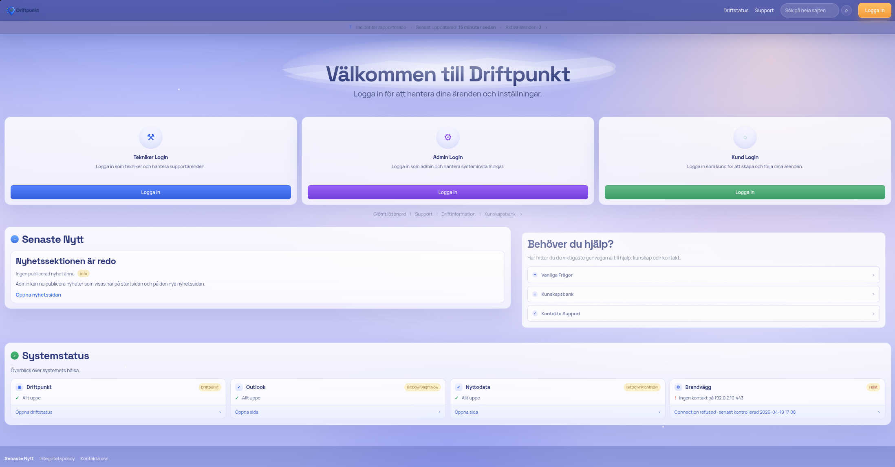
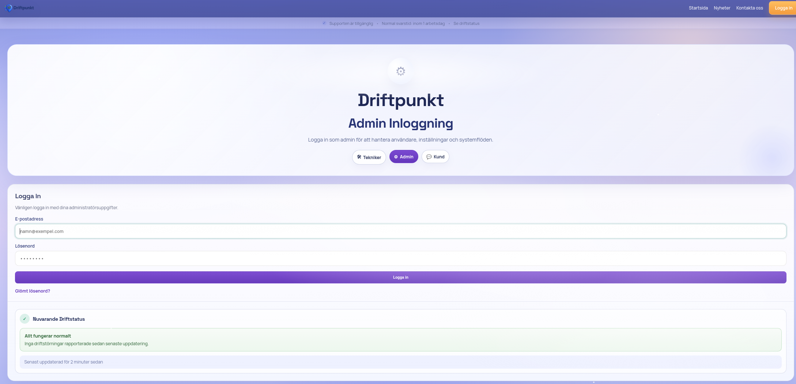
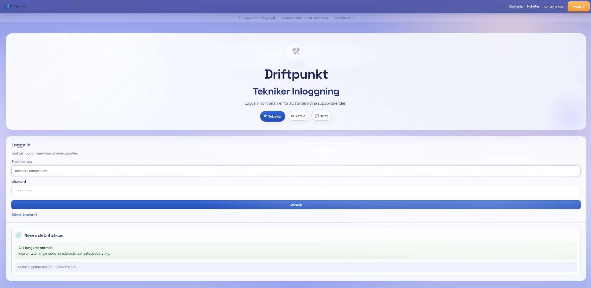
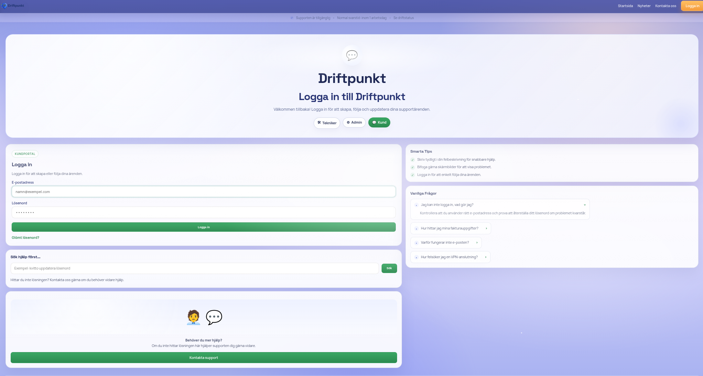

# Driftpunkt

<p align="center">
  
</p>

<p align="center">
  Symfony-baserat ticketsystem for drift, support och kunddialog.
</p>

Driftpunkt ar ett Symfony-baserat ticketsystem for drift, support och kunddialog med publik webb, kundportal, teknikerportal och adminyta i samma produkt.

Det har repot visar den publika/open-core-delen av systemet. Privat driftkod, interna integrationsdelar och vissa releaseverktyg halls utanför den publika exporten.

## Oversikt

Driftpunkt innehaller bland annat:

- publik startsida med driftstatus, nyheter, sok och kontaktvaggar
- kundportal for nya arenden, uppfoljning och kunddialog
- teknikerportal for ticketfloden, prioritering, SLA och aktivitet
- adminyta for identitet, innehall, systemstyrning och oversikt
- kunskapsbas och nyhetsmodul
- paketering for installation och uppgradering

## Skarmbilder

### Startsida



### Inloggning

| Admin | Tekniker |
| --- | --- |
|  |  |

| Kund |
| --- |
|  |

### Portaler

| Kundportal | Teknikerportal |
| --- | --- |
|  |  |

### Adminvy


## Snabbstart

1. Installera beroenden

   ```bash
   composer install
   ```

2. Kor migrationer

   ```bash
   php bin/console doctrine:migrations:migrate -n
   ```

3. Skapa testkonton eller en forsta admin

   ```bash
   php bin/console app:create-test-accounts
   ```

   eller

   ```bash
   php bin/console app:create-admin dinmail@example.com DittLosenord123 Fornamn Efternamn super_admin
   ```

4. Starta appen

   ```bash
   symfony server:start
   ```

   Om Symfony CLI saknas:

   ```bash
   php -S 127.0.0.1:8000 -t public
   ```

5. Oppna `http://127.0.0.1:8000`

## Snabbstart Med Docker Compose

Om du foredrar containerbaserad drift kan du starta projektet med Docker Compose:

1. Bygg och starta tjansterna

   ```bash
   docker compose up -d --build
   ```

2. Kor migrationer i containern

   ```bash
   docker compose exec php php bin/console doctrine:migrations:migrate -n
   ```

3. (Valfritt) skapa testkonton

   ```bash
   docker compose exec php php bin/console app:create-test-accounts
   ```

4. Oppna `http://127.0.0.1:8000`

## Testkonton

Om du kor `app:create-test-accounts` skapas:

| Roll | E-post | Losenord |
| --- | --- | --- |
| Super admin | `admin@test.local` | `AdminPassword123` |
| Tekniker | `tech@test.local` | `TechPassword123` |
| Kund | `customer@test.local` | `CustomerPassword123` |

## Viktiga Kommandon

```bash
php bin/console app:create-test-accounts
php bin/console app:create-admin <email> <losenord> <fornamn> <efternamn> <admin|super_admin>
php bin/console app:mail:ingest <spoolfil>
php bin/console app:mail:poll
php bin/console app:check-ticket-sla
php bin/console app:archive-ticket-attachments
php bin/console app:maintenance status
php bin/console app:release:build-packages
composer export:public-repo
php bin/phpunit
```

## Releasepaket

Bygg bada paketen:

```bash
composer build:packages
```

Bygg bara uppgraderingspaketet:

```bash
composer build:upgrade-package
```

Bygg bara installationspaketet:

```bash
composer build:install-package
```

## Publik Export

Skapa en publik arbetskopia fran den privata repot:

```bash
composer export:public-repo
```

Peka exporten direkt mot en lokal klon av den publika GitHub-repot:

```bash
php bin/console app:repo:export-public --output-dir=/path/to/-Driftpunkt
```

Exporten behaller publika projektmappar men filtrerar bort privata delar som:

- `src/Module/Mail`
- `src/Module/Portal`
- interna release- och driftverktyg i `src/Module/System/Service`
- `templates/portal`
- `templates/emails`
- `deploy/`

Rekommenderat arbetsflode:

1. Utveckla i `Driftpunkt-privat`
2. Exportera till den publika repot
3. Granska diffen noggrant
4. Commit:a och pusha nar exporten ser ren ut

## Dokumentation

Dokumentationen i `docs/` beskriver nulaget i koden, inte en framtida malbild:

- `docs/driftpunkt_ticket_system_spec.md`
- `docs/product_scope_and_mvp.md`
- `docs/installation_and_deployment.md`
- `docs/roles_and_permissions.md`
- `docs/data_model.md`
- `docs/ticket_lifecycle_and_visibility.md`
- `docs/customer_portal_experience.md`
- `docs/admin_information_architecture.md`
- `docs/mail_configuration_guide.md`
- `docs/mail_processing_rules.md`
- `docs/mail_polling_operations.md`
- `docs/ticket_attachment_archiving_operations.md`
- `docs/operational_model.md`
- `docs/security_requirements.md`
- `docs/testing_and_quality.md`
- `docs/known_limitations.md`
- `docs/documentation_reuse_and_plan.md`
