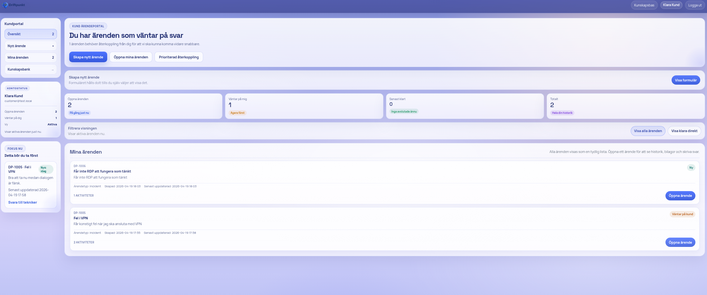
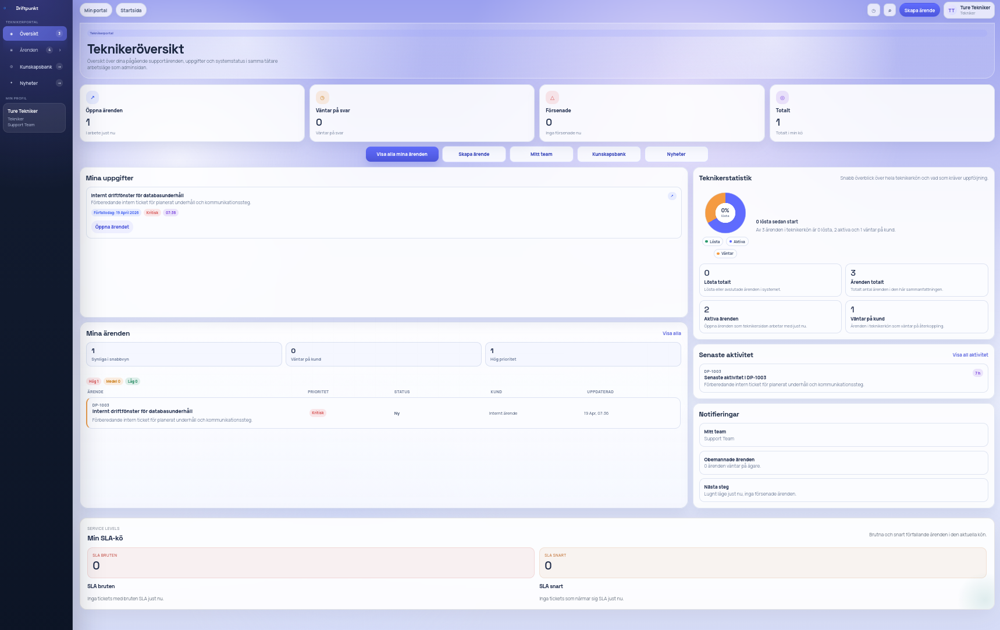
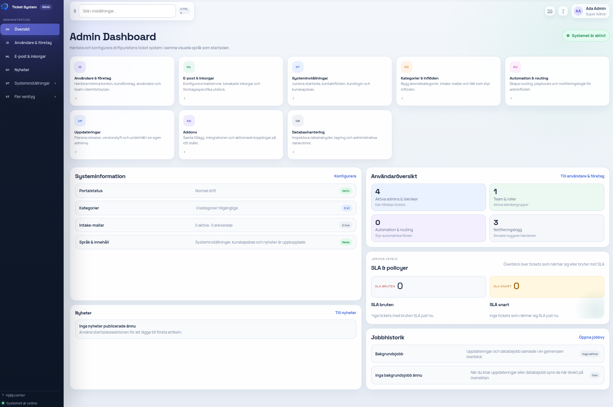

# Driftpunkt Release Packages


Driftpunkt is a support and operations platform for handling tickets, customer communication, technician work queues, operational status updates, knowledge base content, reports, company administration, and maintenance workflows.

This public repository contains packaged Driftpunkt releases only. It does not publish the private application source code, internal modules, environment files, customer data, or deployment secrets.

The screenshots may show the Swedish interface. Language and branding can be changed after installation through the running application and its environment-specific configuration.

## Screenshots








## What Driftpunkt Includes

- Public pages for status, news, search, contact, and policy information.
- Customer ticket creation and customer-facing case follow-up.
- Technician queues for prioritization, comments, SLA follow-up, and knowledge base work.
- Admin tools for identity, paginated company management, settings, reports, maintenance mode, imports, updates, and operational tasks.
- Company hierarchy management where subsidiaries stay grouped with their parent company and search opens relevant groups.
- Mail ingestion, draft review, company monthly reports, public ticket intake, read-only ticket API, and package-based updates.
- Release packages with bundled dependencies, metadata, release notes, and SHA-256 checksums.

## Packages

- Current exported release: `1.0.37`.
- Fresh installation package: `packages/driftpunkt-install-1.0.37.zip`
- Newest cumulative upgrade package: `packages/driftpunkt-upgrade-1.0.37.zip`
- Older upgrade packages are kept as fallback and history, up to the latest 3 upgrade builds available during export.
- SHA-256 checksum files are generated beside every package.
- Public README assets exported here: 9.

## Latest Release Notes

These notes are copied from the packaged release metadata for the current exported version.

### Driftpunkt 1.0.37

### Highlights

- Upgrade packages are now marked as cumulative for Driftpunkt 1.x, so the newest `driftpunkt-upgrade-*.zip` is the normal path even when an installation is several releases behind.
- Release metadata now includes `cumulativeUpgrade` and `minimumSupportedVersion` for upgrade packages.
- The admin update panel shows the installed version, version comparison, and cumulative package status before applying a package.
- Public repository exports now present the newest cumulative upgrade package first and describe older packages as fallback and release history.

### Improved

- The code updater skips files that are already identical while still removing obsolete managed files from the installation.
- Runtime data such as `.env*`, `var/`, and uploaded branding assets remain protected when a full cumulative package is applied.
- README and operations guides now document the cumulative update policy for Debian, NAS, the admin flow, and the public repository.

### Operations

- No database migration is required for this release.
- Requires cache refresh: yes.
- Requires restart/reload: recommended after update so PHP/OPcache and Apache load the new code.
- Normally use the newest `driftpunkt-upgrade-1.0.37.zip` even if the installation is several releases behind.

### Verification

- Upload `driftpunkt-upgrade-1.0.37.zip` in Admin -> Updates and confirm that the package is shown as cumulative.
- Confirm that the installed version and version comparison are visible in the package row.
- Apply the package in maintenance mode and verify that Composer install, migrations, and cache refresh complete successfully.
- Confirm that `.env*`, uploaded branding, and runtime data under `var/` remain in place after the update.
- Export the public repository and confirm that the README lists the newest cumulative upgrade package first.

## What This Repository Contains

- `packages/`: install and upgrade zip files.
- `packages/*.sha256`: checksum files for package verification.
- `assets/`: logo and screenshots used by this README.
- `PUBLIC_EXPORT_MANIFEST.md`: export summary with package versions and checksums.

## Fresh installation

Use the install package for a new server, NAS, or clean application directory.

1. Download the latest `driftpunkt-install-*.zip` file and its matching `.sha256` file from `packages/`.
2. Verify the package before unpacking it:

```bash
cd packages
sha256sum -c driftpunkt-install-1.0.37.zip.sha256
```

3. Create a clean application directory on the target server or NAS.
4. Unpack the zip file into that directory.
5. Point the web server document root to the unpacked application directory's `htdocs/` folder. On shared hosting where the fixed public directory is already named `/htdocs`, unpack the whole package there and keep the package root `.htaccess` enabled.
6. Configure the environment file for your deployment. Start from the example files included inside the package and set real secrets, database credentials, mail settings, and domain-specific values.
7. Start the database and web runtime for your deployment model.
8. Run the installer from the unpacked application directory:

```bash
php bin/console app:install:fresh --env=prod
```

9. Sign in with the configured administrator account, change default credentials, review branding/language settings, and verify the public status page.

## Install on a new Debian server

This flow installs Driftpunkt without Docker on a clean Debian server. Replace `driftpunkt.example.com`, passwords, and mail settings before production use.

1. Install the tools needed to unpack the release package:

```bash
sudo apt-get update
sudo apt-get install -y unzip
```

2. Download or copy `driftpunkt-install-1.0.37.zip` and `driftpunkt-install-1.0.37.zip.sha256` to the server, then verify the package:

```bash
sha256sum -c driftpunkt-install-1.0.37.zip.sha256
```

3. Unpack the release into `/var/www/driftpunkt`:

```bash
rm -rf /tmp/driftpunkt-install
mkdir -p /tmp/driftpunkt-install
unzip driftpunkt-install-1.0.37.zip -d /tmp/driftpunkt-install
sudo mkdir -p /var/www/driftpunkt
sudo cp -a /tmp/driftpunkt-install/driftpunkt-install-1.0.37/. /var/www/driftpunkt/
cd /var/www/driftpunkt
```

4. Run the Debian setup script. It installs Apache, PHP packages, MariaDB, Composer, logrotate, and Driftpunkt systemd timers:

```bash
DOMAIN=driftpunkt.example.com sudo -E bash deploy/debian/setup.sh
```

5. Edit `/var/www/driftpunkt/.env.local` and set real values for `APP_SECRET`, `DEFAULT_URI`, `DATABASE_URL`, `MAILER_DSN`, and `MAILER_FROM`:

```bash
sudo nano /var/www/driftpunkt/.env.local
```

6. Create the MariaDB database and user. Use the same password in `DATABASE_URL`:

```bash
sudo mariadb
```

```sql
CREATE DATABASE driftpunkt CHARACTER SET utf8mb4 COLLATE utf8mb4_unicode_ci;
CREATE USER 'driftpunkt'@'localhost' IDENTIFIED BY 'change-this-database-password';
GRANT ALL PRIVILEGES ON driftpunkt.* TO 'driftpunkt'@'localhost';
FLUSH PRIVILEGES;
EXIT;
```

7. Initialize Driftpunkt:

```bash
sudo -u www-data php /var/www/driftpunkt/bin/console app:install:fresh --env=prod
```

8. Confirm that Apache serves `/var/www/driftpunkt/htdocs`, then reload Apache and add HTTPS, for example with Certbot:

```bash
sudo apache2ctl configtest
sudo systemctl reload apache2
sudo apt-get install -y certbot python3-certbot-apache
sudo certbot --apache -d driftpunkt.example.com
```

## Install on a new NAS with Docker Compose

This flow uses the Docker Compose stack included inside the install package. Adjust `/volume1/docker/driftpunkt` to the application path used by your NAS.

1. Copy `driftpunkt-install-1.0.37.zip` and `driftpunkt-install-1.0.37.zip.sha256` to the NAS, then verify the package:

```bash
sha256sum -c driftpunkt-install-1.0.37.zip.sha256
```

2. Unpack the release into a persistent NAS folder:

```bash
rm -rf /tmp/driftpunkt-install
mkdir -p /tmp/driftpunkt-install /volume1/docker/driftpunkt
unzip driftpunkt-install-1.0.37.zip -d /tmp/driftpunkt-install
cp -a /tmp/driftpunkt-install/driftpunkt-install-1.0.37/. /volume1/docker/driftpunkt/
cd /volume1/docker/driftpunkt
```

3. Create and edit the NAS environment file:

```bash
cp deploy/nas/.env.example deploy/nas/.env
nano deploy/nas/.env
```

Set real values for `APP_SECRET`, `DEFAULT_URI`, `MARIADB_PASSWORD`, `MARIADB_ROOT_PASSWORD`, `DATABASE_URL`, `MAILER_DSN`, and `MAILER_FROM`.

4. Create persistent data folders and start the stack:

```bash
mkdir -p deploy/nas/data/var deploy/nas/data/mariadb
docker compose -f deploy/nas/compose.yaml --env-file deploy/nas/.env up -d --build
```

5. Initialize Driftpunkt inside the app container:

```bash
docker compose -f deploy/nas/compose.yaml --env-file deploy/nas/.env exec --user www-data app php bin/console app:install:fresh --env=prod
```

6. Open the URL from `DEFAULT_URI`, sign in, change default credentials, and confirm that the app and scheduler containers are healthy:

```bash
docker compose -f deploy/nas/compose.yaml --env-file deploy/nas/.env ps
docker compose -f deploy/nas/compose.yaml --env-file deploy/nas/.env logs -f app scheduler
```

## Upgrade an existing installation

1. Use the newest cumulative `driftpunkt-upgrade-*.zip` package first. It contains the full current codebase and is the normal path even when the installed site is several releases behind.
2. Back up the database and application files before applying the upgrade.
3. Verify the checksum before using the package:

```bash
cd packages
sha256sum -c driftpunkt-upgrade-<version>.zip.sha256
```

4. Apply the package through the Driftpunkt admin update flow when available, or unpack it according to your deployment procedure.
5. Confirm that the web server document root points to `htdocs/`, or that the package root `.htaccess` is active when the whole package lives in a fixed `/htdocs` directory.
6. Run database migrations, cache refresh, service reloads, and any other post-update steps listed in the package metadata and release notes.
7. For version 1.0.21 or later, also verify Admin -> Identity links to the dedicated company page and Admin -> Companies paginates company groups correctly.
8. Older upgrade packages are kept as fallback and history, not as required intermediate steps.
9. Verify login, ticket creation, customer/technician portals, status page, and background jobs before leaving maintenance mode.

## Available upgrade packages

- `packages/driftpunkt-upgrade-1.0.37.zip`
- `packages/driftpunkt-upgrade-1.0.33.zip`
- `packages/driftpunkt-upgrade-1.0.32.zip`

## Notes

- Keep private `.env`, backup, database dump, and customer files outside this repository.
- Driftpunkt release packages prefer `htdocs/` as document root. If the full package must live directly in a fixed `/htdocs` web root, verify that `.htaccess` blocks `config/`, `src/`, `vendor/`, and `var/` before production use.
- Review `PUBLIC_EXPORT_MANIFEST.md` after every export before committing to the public repository.
- If checksum verification fails, do not install the package. Rebuild and export the release from the private repository.
