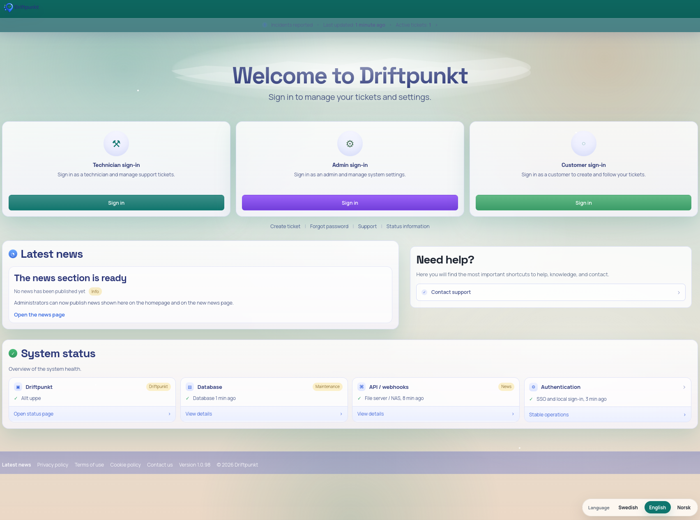
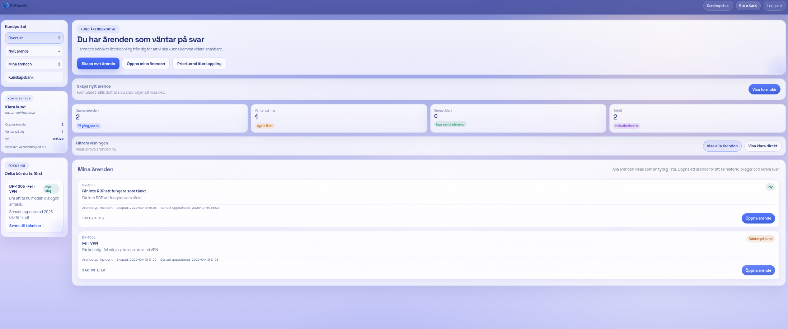
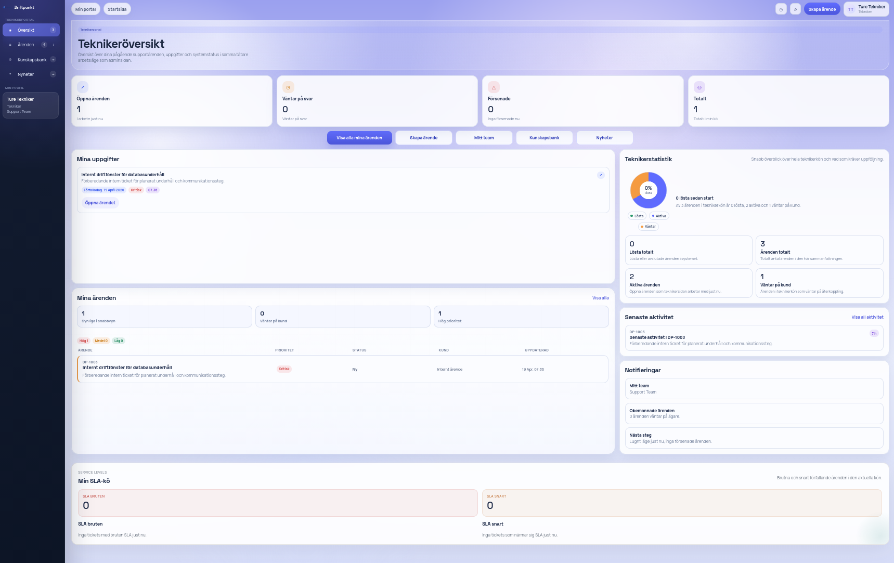
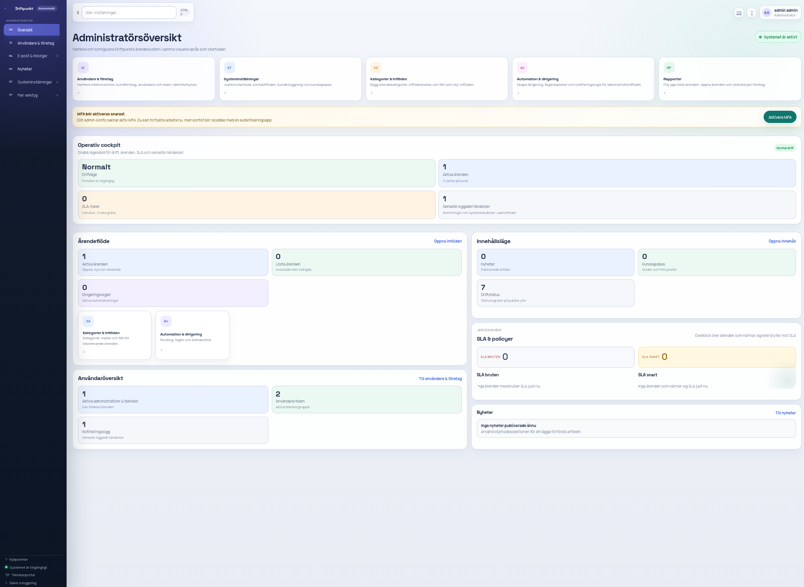

# Driftpunkt Release Packages


Driftpunkt is a support and operations platform for handling tickets, customer communication, technician work queues, operational status updates, knowledge base content, reports, company administration, and maintenance workflows.

This public repository contains packaged Driftpunkt releases only. It does not publish the private application source code, internal modules, environment files, customer data, or deployment secrets.

The screenshots may show the Swedish interface. Language and branding can be changed after installation through the running application and its environment-specific configuration.

## Screenshots









## What Driftpunkt Includes

- A public website for the homepage, operational status, news, search, contact details, public knowledge base content, and legal policy pages.
- Public ticket intake for visitors when the feature is enabled, plus authenticated customer portals for ongoing support dialogue.
- Customer accounts for both company customers and private customers, including password reset, language switching, ticket follow-up, comments, feedback, and customer-visible knowledge base content; super administrators can provision multiple company customers at once with secure temporary passwords.
- Customer-facing resources such as allowlisted company reports, computer lists, and printer lists under a translated "My resources" menu when those resources are enabled.
- Technician and ticket coordinator portals for queue work, triage, comments, assignment, conditional SLA follow-up, reports, activity, notifications, company inventory lookup, and internal issue or feature-request reporting.
- Full ticket lifecycle support with statuses, priorities, impact levels, request types, routing rules, teams, multiple responsible technicians, internal notes, customer-visible replies, attachments, checklists, playbooks, and customer feedback reminders.
- Admin tools for identity, companies, company hierarchies, teams, mail, ticket categories, intake templates, routing, SLA policies, public content, reports, logs, background jobs, settings, updates, and maintenance mode, with identity work split into focused user, customer, team, appearance, and triage sections.
- Mail ingestion through spool or mailbox polling, incoming mail review, correction drafts, mailbox routing, outgoing profiles, ticket notification emails, and technician/customer links back to the related ticket.
- Knowledge base and news management with public, customer, technician, and admin-facing workflows, optional technician contributions, smart tips, FAQ-style content, and status communication.
- Operational tooling for read-only ticket API access, monthly company reports, database jobs, backups, restore/optimize tasks, migration runs, code update staging, package application, addon package registration, log export, and controlled cleanup.
- Localization and personalization for Swedish, English, and Norwegian UI text, personal default language in technician, coordinator, admin, and super admin workflows, global default/selectable language governance, branding assets, MFA settings, remote support shortcuts, and portal theme templates.
- Release packages with bundled dependencies, metadata, release notes, post-update guidance, and SHA-256 checksums.

## Profiles and What They Can Do

Visible features depend on enabled settings, company access, and role permissions, but Driftpunkt currently supports these main profiles:

### Public Visitor

- Read the public homepage, operational status, news, public knowledge base articles, contact page, and legal pages.
- Search public content from the server-rendered website.
- Create a public support ticket without signing in when public ticket intake is enabled.
- Follow general status and maintenance information published by the service team.

### Company Customer

- Sign in to the customer portal and follow tickets connected to the customer account or shared through the company.
- Create tickets, add customer comments, see ticket status, and participate in the support dialogue for tickets they can access.
- Read customer-visible knowledge base content and operational status information.
- Leave feedback on resolved or closed tickets when customer feedback is enabled.
- Open company resources such as reports, computer lists, and printer lists when the company has the feature enabled and the specific user has been granted access.
- Use customer reports only when explicitly allowlisted by an admin for that company user.
- Switch portal language between Swedish, English, and Norwegian.

### Private Customer

- Register a private customer account when self-registration is enabled.
- Sign in, reset password, create personal support tickets, comment on accessible tickets, and follow personal case status.
- Read customer-visible knowledge base and status information.
- Provide feedback on completed tickets when the feedback workflow is enabled.
- Private customers are separate from company report/resource access, which is controlled per company user.

### Technician

- Work from a technician overview built around assigned tickets, team tickets, queue health, recent activity, and notifications, with SLA cards and controls shown only when SLA is enabled and actively used.
- Create tickets, take over tickets, assign work, update status, priority, impact, request type, routing, optional SLA fields, checklist progress, and internal work notes.
- Reply to customers, add internal comments, use ticket attachments when enabled, and follow links from technician notification emails back to the related ticket.
- See all tickets or only permitted tickets depending on the technician access setting.
- Use knowledge base and news contribution workflows when enabled.
- Report bugs, improvements or feature requests, and missing customers to super administrators from the technician menu.
- Use technician inventory views, remote support shortcuts, secure login/MFA with optional seven-day trusted devices, personal default language, and selectable portal theme templates, including the burgundy Bordeaux theme.

### Ticket Coordinator

- Use a coordinator overview for unassigned work, stale tickets, waiting customer cases, workload, and triage signals, with SLA signals shown only when SLA is in use.
- Distribute tickets to technicians or teams, follow company and queue health, add comments, and keep cases moving without needing full admin access.
- Open clearer coordinator and customer reports by company and period for inflow, backlog, status, priority, impact, request type, escalation, risk, ticket aging, and SLA only when applicable.
- Follow an expanded coordinator guide for assignment, tickets in progress, closed tickets, comment visibility, reopening, and reporting, and submit internal reports from the same portal.
- View company data plus computer and printer inventory when data exists and access is available.
- Save a personal default language so the coordinator portal opens in the preferred language on the next login.

### Admin

- Manage regular operational administration: tickets, companies, users that are not privileged beyond their permission level, teams, categories, routing rules, intake templates, SLA policies, and support settings.
- Configure customer portal features, company hierarchy visibility, ticket attachments, feedback, monthly company reports, MFA policy, remote support tools, public ticket intake, and customer self-registration.
- Manage public content such as homepage settings, contact information, news, status messaging, knowledge base settings, translation languages, selectable language settings, UI translation overrides, privacy policy, terms, and cookie policy.
- Manage mail servers, support inboxes, outgoing mail profiles, incoming mail review, correction drafts, and mailbox-based ticket creation.
- Use admin reports for ticket inflow, backlog, SLA health, risk, companies, and internal workload.
- Review application logs and notification logs, with super-admin-only controls hidden where appropriate.

### Super Admin

- Has full system and operational access, including all admin and technician capabilities.
- Create or assign privileged profiles such as super admin, admin, and ticket coordinator.
- Create multiple company customer accounts in one operation, with automatic secure temporary passwords and forced password changes at first sign-in.
- Review internal reports from technicians and ticket coordinators, update their status, and leave reporter-visible feedback.
- Reset or disable MFA for locked-out users without exposing their MFA secret or enrollment QR code; recovery actions are audit logged.
- Manage destructive or infrastructure-sensitive actions such as database backup/download/restore/optimize, migration execution, code update staging/application, post-update tasks, job retry/purge, log export/cleanup, test ticket purge, branding, support branding, and addon package lifecycle.
- Configure global maintenance mode, timezone, default language, selectable languages, system status monitor settings, public ticket form controls, privileged mail tests, knowledge base controls, remote support download URLs, and secure update flows.

### System and Automation

- Poll support mailboxes or process mail spool input and create tickets or draft reviews from incoming messages.
- Run due operational tasks for mail polling, SLA checks, monthly reports, customer feedback reminders, attachment archiving, database jobs, and post-update steps.
- Provide a read-only token-based ticket API for controlled exports.
- Build and apply cumulative install/upgrade packages with vendor dependencies included, release metadata, and checksum verification.

## Packages

- Current exported release: `1.0.96`.
- Fresh installation package: `packages/driftpunkt-install-1.0.96.zip`
- Newest cumulative upgrade package: `packages/driftpunkt-upgrade-1.0.96.zip`
- Older upgrade packages are kept as fallback and history, up to the latest 3 upgrade builds available during export.
- SHA-256 checksum files are generated beside every package.
- Public README assets exported here: 9.

## Latest Release Notes

These notes are copied from the packaged release metadata for the current exported version.

### Driftpunkt 1.0.96

### Highlights

- The coordinator work filter previously labelled "Open tickets" is now labelled "In progress", matching the ticket status selected by the filter.
- Coordinator guidance is updated in Swedish, English, and Norwegian to distinguish assignment from ticket status.
- A new personal portal theme named "Bordeaux" adds burgundy accents, a dark burgundy sidebar, and light rose-tinted page backgrounds.
- Active navigation, primary actions, selection markers, and coordinator controls now use the selected theme accent more consistently.

### Operations

- Database migration required: no.
- Cache refresh required: yes.
- PHP/OPcache restart or reload recommended: yes.
- The cumulative upgrade package can be applied directly to an existing Driftpunkt 1.x installation, including 1.0.95.
- Back up the application and database before applying the package through the admin updater.

### Verification

- Confirm the admin overview shows Driftpunkt `1.0.96` after the update.
- Confirm `release-metadata.json` reports version `1.0.96`, minimum supported version `1.0.0`, no required database migration, and includes these release notes.
- Open the coordinator portal and confirm the navigation and filter use "In progress" / "Under arbete" for tickets whose status is in progress.
- Confirm "Assigned" still includes all non-closed tickets with an assigned technician, independently of the ticket status.
- Open technician or coordinator settings, select the "Bordeaux" theme, save, and confirm burgundy accents are used for navigation, primary actions, and selection states.
- Confirm the release package checksums before applying the package.

## What This Repository Contains

- `packages/`: install and upgrade zip files.
- `packages/*.sha256`: checksum files for package verification.
- `assets/`: logo and screenshots used by this README.
- `PUBLIC_EXPORT_MANIFEST.md`: export summary with package versions and checksums.

## Fresh installation

Use the install package for a new server, NAS, or clean application directory.

1. Download the latest `driftpunkt-install-*.zip` file and its matching `.sha256` file from `packages/`.
2. Verify the package before unpacking it:

```bash
cd packages
sha256sum -c driftpunkt-install-1.0.96.zip.sha256
```

3. Create a clean application directory on the target server or NAS.
4. Unpack the zip file into that directory.
5. Point the web server document root to the unpacked application directory's `htdocs/` folder. On shared hosting where the fixed public directory is already named `/htdocs`, unpack the whole package there and keep the package root `.htaccess` enabled.
6. Configure the environment file for your deployment. Start from the example files included inside the package and set real secrets, database credentials, mail settings, and domain-specific values.
7. Start the database and web runtime for your deployment model.
8. Run the installer from the unpacked application directory:

```bash
php bin/console app:install:fresh --env=prod
```

9. Sign in with the configured administrator account, change default credentials, review branding/language settings, and verify the public status page.

## Install on a new Debian server

This flow installs Driftpunkt without Docker on a clean Debian server. Replace `driftpunkt.example.com`, passwords, and mail settings before production use.

1. Install the tools needed to unpack the release package:

```bash
sudo apt-get update
sudo apt-get install -y unzip
```

2. Download or copy `driftpunkt-install-1.0.96.zip` and `driftpunkt-install-1.0.96.zip.sha256` to the server, then verify the package:

```bash
sha256sum -c driftpunkt-install-1.0.96.zip.sha256
```

3. Unpack the release into `/var/www/driftpunkt`:

```bash
rm -rf /tmp/driftpunkt-install
mkdir -p /tmp/driftpunkt-install
unzip driftpunkt-install-1.0.96.zip -d /tmp/driftpunkt-install
sudo mkdir -p /var/www/driftpunkt
sudo cp -a /tmp/driftpunkt-install/driftpunkt-install-1.0.96/. /var/www/driftpunkt/
cd /var/www/driftpunkt
```

4. Run the Debian setup script. It installs Apache, PHP packages, MariaDB, Composer, logrotate, and Driftpunkt systemd timers:

```bash
DOMAIN=driftpunkt.example.com sudo -E bash deploy/debian/setup.sh
```

5. Edit `/var/www/driftpunkt/.env.local` and set real values for `APP_SECRET`, `DEFAULT_URI`, `DATABASE_URL`, `MAILER_DSN`, and `MAILER_FROM`:

```bash
sudo nano /var/www/driftpunkt/.env.local
```

6. Create the MariaDB database and user. Use the same password in `DATABASE_URL`:

```bash
sudo mariadb
```

```sql
CREATE DATABASE driftpunkt CHARACTER SET utf8mb4 COLLATE utf8mb4_unicode_ci;
CREATE USER 'driftpunkt'@'localhost' IDENTIFIED BY 'change-this-database-password';
GRANT ALL PRIVILEGES ON driftpunkt.* TO 'driftpunkt'@'localhost';
FLUSH PRIVILEGES;
EXIT;
```

7. Initialize Driftpunkt:

```bash
sudo -u www-data php /var/www/driftpunkt/bin/console app:install:fresh --env=prod
```

8. Confirm that Apache serves `/var/www/driftpunkt/htdocs`, then reload Apache and add HTTPS, for example with Certbot:

```bash
sudo apache2ctl configtest
sudo systemctl reload apache2
sudo apt-get install -y certbot python3-certbot-apache
sudo certbot --apache -d driftpunkt.example.com
```

## Install on a new NAS with Docker Compose

This flow uses the Docker Compose stack included inside the install package. Adjust `/volume1/docker/driftpunkt` to the application path used by your NAS.

1. Copy `driftpunkt-install-1.0.96.zip` and `driftpunkt-install-1.0.96.zip.sha256` to the NAS, then verify the package:

```bash
sha256sum -c driftpunkt-install-1.0.96.zip.sha256
```

2. Unpack the release into a persistent NAS folder:

```bash
rm -rf /tmp/driftpunkt-install
mkdir -p /tmp/driftpunkt-install /volume1/docker/driftpunkt
unzip driftpunkt-install-1.0.96.zip -d /tmp/driftpunkt-install
cp -a /tmp/driftpunkt-install/driftpunkt-install-1.0.96/. /volume1/docker/driftpunkt/
cd /volume1/docker/driftpunkt
```

3. Create and edit the NAS environment file:

```bash
cp deploy/nas/.env.example deploy/nas/.env
nano deploy/nas/.env
```

Set real values for `APP_SECRET`, `DEFAULT_URI`, `MARIADB_PASSWORD`, `MARIADB_ROOT_PASSWORD`, `DATABASE_URL`, `MAILER_DSN`, and `MAILER_FROM`. After signing in, configure the internal-report recipient and reply mailbox in the super-admin cockpit.

4. Create persistent data folders and start the stack:

```bash
mkdir -p deploy/nas/data/var deploy/nas/data/mariadb
docker compose -f deploy/nas/compose.yaml --env-file deploy/nas/.env up -d --build
```

5. Initialize Driftpunkt inside the app container:

```bash
docker compose -f deploy/nas/compose.yaml --env-file deploy/nas/.env exec --user www-data app php bin/console app:install:fresh --env=prod
```

6. Open the URL from `DEFAULT_URI`, sign in, change default credentials, and confirm that the app and scheduler containers are healthy:

```bash
docker compose -f deploy/nas/compose.yaml --env-file deploy/nas/.env ps
docker compose -f deploy/nas/compose.yaml --env-file deploy/nas/.env logs -f app scheduler
```

## Upgrade an existing installation

1. Use the newest cumulative `driftpunkt-upgrade-*.zip` package first. It contains the full current codebase and is the normal path even when the installed site is several releases behind.
2. Back up the database and application files before applying the upgrade.
3. Verify the checksum before using the package:

```bash
cd packages
sha256sum -c driftpunkt-upgrade-<version>.zip.sha256
```

4. Apply the package through the Driftpunkt admin update flow when available, or unpack it according to your deployment procedure.
5. Confirm that the web server document root points to `htdocs/`, or that the package root `.htaccess` is active when the whole package lives in a fixed `/htdocs` directory.
6. Run database migrations, cache refresh, service reloads, and any other post-update steps listed in the package metadata and release notes.
7. For version 1.0.21 or later, also verify Admin -> Identity links to the dedicated company page and Admin -> Companies paginates company groups correctly.
8. Older upgrade packages are kept as fallback and history, not as required intermediate steps.
9. Verify login, ticket creation, customer/technician portals, status page, and background jobs before leaving maintenance mode.

### Interrupted 1.0.45 Migration

Version `1.0.46` and later fix the 1.0.45 customer report migration error `Call to undefined method Doctrine\DBAL\Schema\Table::changeColumn()`. If an upgrade stopped on that error, apply the latest `driftpunkt-upgrade-<version>.zip` and rerun the migration step after the fixed files are in place:

```bash
php bin/console doctrine:migrations:migrate --no-interaction --allow-no-migration --all-or-nothing --env=prod
```

The failed 1.0.45 run stops before Doctrine records the migration as completed, so the patched 1.0.46 migration can normally run again without manual database edits. Always confirm that a fresh database backup exists before resuming an interrupted production upgrade.

## Available upgrade packages

- `packages/driftpunkt-upgrade-1.0.96.zip`
- `packages/driftpunkt-upgrade-1.0.94.zip`
- `packages/driftpunkt-upgrade-1.0.93.zip`

## Notes

- Keep private `.env`, backup, database dump, and customer files outside this repository.
- Driftpunkt release packages prefer `htdocs/` as document root. If the full package must live directly in a fixed `/htdocs` web root, verify that `.htaccess` blocks `config/`, `src/`, `vendor/`, and `var/` before production use.
- Review `PUBLIC_EXPORT_MANIFEST.md` after every export before committing to the public repository.
- If checksum verification fails, do not install the package. Rebuild and export the release from the private repository.
